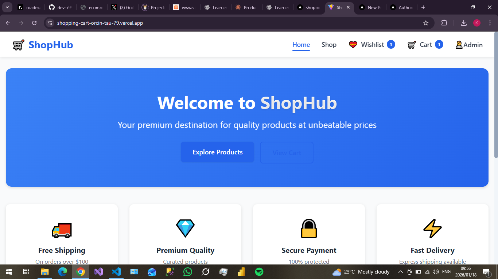
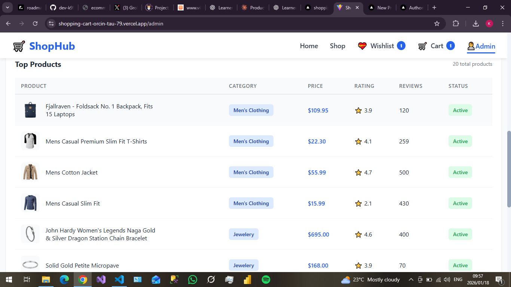
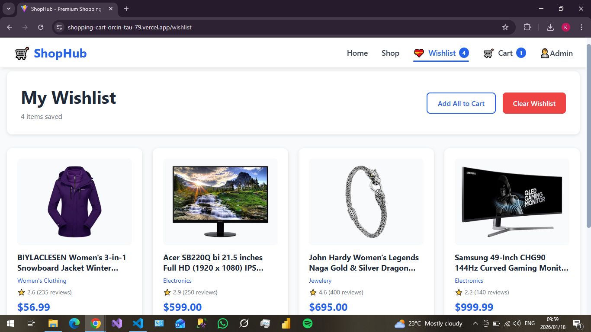
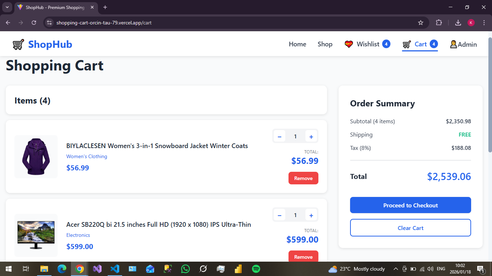
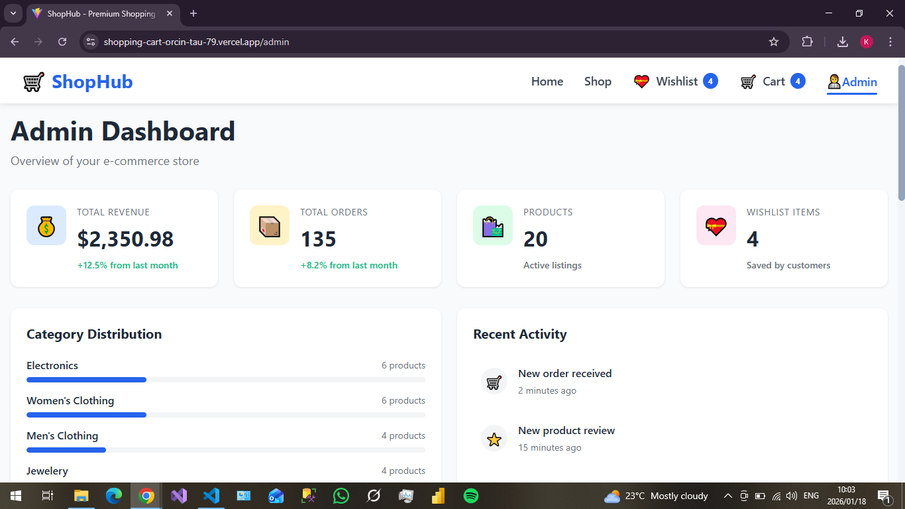

# 🛒 ShopHub - Enterprise E-Commerce Platform

A production-ready, full-featured e-commerce shopping cart application built with modern web technologies. Features include real-time cart management, wishlist functionality, admin analytics dashboard, and persistent state management.

**🔗 Live Demo:** [Live Demo](https://shopping-cart-orcin-tau-79.vercel.app/) 

---

## 📸 Screenshots

### 🏠 Landing Page


### 🛍️ Product Catalog


### 💝 Wishlist Management


### 🛒 Shopping Cart


### 📊 Admin Dashboard


---

## ✨ Key Features

### 🎯 Core Functionality
- **Product Catalog** - Browse 20+ products from FakeStore API with images, descriptions, and ratings
- **Advanced Filtering** - Search, category filter, and multi-criteria sorting (price, rating, name)
- **Shopping Cart** - Add/remove items, adjust quantities, real-time total calculation
- **Wishlist System** - Save favorite items, batch add to cart, persistent storage
- **Admin Dashboard** - Real-time analytics, sales metrics, product management
- **Responsive Design** - Mobile-first approach, optimized for all screen sizes

### 🔧 Technical Features
- **TypeScript** - Full type safety and IntelliSense support
- **State Management** - React Context API with custom hooks
- **Local Storage** - Persistent cart and wishlist across sessions
- **Toast Notifications** - Real-time user feedback for all actions
- **Loading States** - Skeleton screens and spinners for better UX
- **Error Handling** - Graceful error boundaries and user-friendly messages
- **Code Splitting** - Lazy loading for optimal performance
- **SEO Optimized** - Meta tags, semantic HTML, and accessibility features

---

## 🛠️ Technology Stack

### Frontend
| Technology | Version | Purpose |
|-----------|---------|---------|
| **React** | 18.2 | UI library for building component-based interfaces |
| **TypeScript** | 5.2 | Type-safe JavaScript for better developer experience |
| **Vite** | 5.0 | Next-generation frontend tooling, lightning-fast HMR |
| **React Router** | 6.20 | Client-side routing and navigation |

### Styling
| Technology | Purpose |
|-----------|---------|
| **CSS3** | Custom styles with CSS variables for theming |
| **Flexbox/Grid** | Modern layout techniques |
| **CSS Modules** | Scoped styling to prevent conflicts |

### State Management
| Technology | Purpose |
|-----------|---------|
| **Context API** | Global state management (Cart, Wishlist, Toast) |
| **Custom Hooks** | Reusable stateful logic (useLocalStorage) |
| **localStorage** | Client-side persistence |

### External APIs
| API | Purpose |
|-----|---------|
| **FakeStore API** | Product data, categories, and ratings |

### Development Tools
| Tool | Purpose |
|------|---------|
| **ESLint** | Code quality and consistency |
| **TypeScript Compiler** | Type checking |
| **Git** | Version control |

### Deployment
| Platform | Purpose |
|----------|---------|
| **Vercel** | Hosting, CI/CD, CDN distribution |

---

## 📁 Project Structure

```
shopping-cart/
├── public/                      # Static assets
│   └── vite.svg
├── src/
│   ├── api/                     # API integration layer
│   │   └── products.ts          # FakeStore API calls
│   ├── components/              # Reusable React components
│   │   ├── cart/                # Cart-related components
│   │   │   ├── CartItem.tsx     # Individual cart item
│   │   │   ├── CartSummary.tsx  # Order summary with calculations
│   │   │   └── EmptyCart.tsx    # Empty state component
│   │   ├── common/              # Shared UI components
│   │   │   ├── Button.tsx       # Customizable button component
│   │   │   ├── LoadingSpinner.tsx
│   │   │   └── Toast.tsx        # Notification system
│   │   ├── layout/              # Layout components
│   │   │   ├── Header.tsx       # Navigation with cart/wishlist badges
│   │   │   ├── Footer.tsx       # Site footer
│   │   │   └── Layout.tsx       # Page wrapper
│   │   └── products/            # Product display components
│   │       ├── ProductCard.tsx  # Product card with wishlist toggle
│   │       └── ProductGrid.tsx  # Responsive product grid
│   ├── context/                 # React Context providers
│   │   ├── CartContext.tsx      # Cart state management
│   │   ├── WishlistContext.tsx  # Wishlist state management
│   │   └── ToastContext.tsx     # Notification system
│   ├── hooks/                   # Custom React hooks
│   │   └── useLocalStorage.ts   # Persistent state hook
│   ├── pages/                   # Page components (routes)
│   │   ├── Home.tsx             # Landing page
│   │   ├── Shop.tsx             # Product catalog
│   │   ├── Cart.tsx             # Shopping cart
│   │   ├── Wishlist.tsx         # Saved items
│   │   └── AdminDashboard.tsx   # Analytics dashboard
│   ├── types/                   # TypeScript type definitions
│   │   ├── product.types.ts     # Product and filter types
│   │   ├── cart.types.ts        # Cart-related types
│   │   └── wishlist.types.ts    # Wishlist types
│   ├── utils/                   # Utility functions
│   │   ├── currency.ts          # Currency formatting
│   │   └── storage.ts           # localStorage wrapper
│   ├── App.tsx                  # Root component with routing
│   ├── App.css                  # Global styles and CSS variables
│   └── main.tsx                 # Application entry point
├── index.html                   # HTML template
├── package.json                 # Dependencies and scripts
├── tsconfig.json                # TypeScript configuration
├── vite.config.ts               # Vite configuration
└── README.md                    # Documentation (you are here)
```

---

## 🚀 Getting Started

### Prerequisites

Ensure you have the following installed:

- **Node.js** >= 18.0.0 ([Download](https://nodejs.org/))
- **npm** >= 9.0.0 (comes with Node.js)
- **Git** ([Download](https://git-scm.com/))

### Installation

1. **Clone the repository**

```bash
git clone https://github.com/dev-k99/ShopHub
cd shopping-cart
```

2. **Install dependencies**

```bash
npm install
```

3. **Start development server**

```bash
npm run dev
```

The application will open at `http://localhost:3000`


## 🎯 Core Features Deep Dive

### 🛍️ Shopping Cart System

**Features:**
- Add/remove products with real-time updates
- Quantity adjustment with increment/decrement controls
- Automatic price calculation (subtotal, tax, shipping)
- Free shipping threshold ($100+)
- Persistent storage across browser sessions

### 💝 Wishlist Feature

**Features:**
- One-click save/unsave products
- Batch add to cart functionality
- Visual heart icon toggle
- Badge counter in navigation
- Persistent across sessions

**User Flow:**
1. Browse products → Click heart icon
2. Item added to wishlist with success notification
3. Navigate to `/wishlist` to view saved items
4. Add individual or all items to cart

### 📊 Admin Dashboard

**Metrics Displayed:**
- Total revenue with trend indicators
- Order count and average order value
- Product catalog statistics
- Wishlist engagement metrics
- Category distribution charts
- Recent activity feed
- Top products table with ratings


## 🤝 Contributing

Contributions are welcome!

</div>